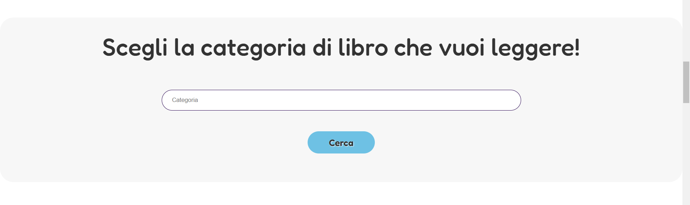
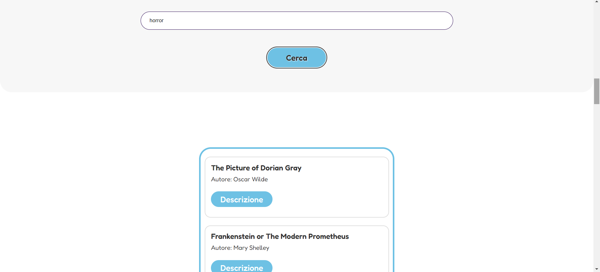
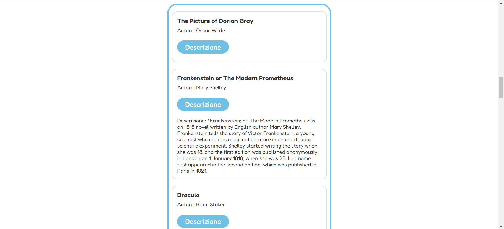

# Owly

**Owly** è una piattaforma educativa interattiva progettata per supportare bambini, genitori e insegnanti nel percorso di apprendimento. La pagina web offre sezioni dedicate alla lettura, allo studio, alla LIS (Lingua dei Segni Italiana) e all’area personale.

---

## ❓ Come funziona

All'apertura verrà visualizzata la homepage, composta da diverse sezioni:

- **Ricerca libri**: una barra dove inserire categorie per trovare libri consigliati.
- **Sezione studio**: card con giochi educativi e materiali interattivi.
- **Sezione LIS**: contenuti accessibili in Lingua dei Segni Italiana.
- **Area personale**: spazio dedicato alla registrazione e alle comunicazioni scolastiche.

---

## 📷 Anteprima

**Ricerca libri**  


**Esecuzione ricerca**  


**Dettaglio libro**  


---

## 📌 Come utilizzare

### ✅ Modalità utente (senza installazione)

1. **Scarica o clona il progetto**  
   Vai su GitHub e clicca su `Code > Download ZIP`.

2. Estrai la cartella scaricata.

3. Apri la cartella `dist/`.

4. Fai doppio clic su **`index.html`** per aprire la pagina nel browser.

> La cartella `dist/` contiene già tutti i file compilati con Webpack.


---

## 🛠️ Tecnologie utilizzate

- **HTML5**
- **CSS3**
- **JavaScript (ES6)**
- [**Axios**](https://axios-http.com/) — per le richieste HTTP
- [**Lodash**](https://lodash.com/) — per utility su array e oggetti
- **Webpack** — per il bundling del progetto


## 🧩 Struttura del progetto 


```
Progetto JavaScript Advanced di Chiara Barletta/
│
├── dist/                       
│   ├── index.html              
│   ├── main.js                 
│   ├── style.css               
│   └── assets/                 
│       └── img/                
│           └── [immagini]      
│
├── assets/                    
│   ├── css/                     
│   │   └── style.css           
│   ├── img/                     
│   │   └── [immagini]          
│   └── script/                  
│       └── app.js              
│
├── index.html                  
├── webpack.config.js           
├── package.json                
├── .gitignore                  
├── README.md                   
└── Presentazione.pdf            
``` 

## 👩🏻‍💻 Autrice

Chiara Barletta


## 🌐 Demo Online

Visualizza il progetto su [Netlify](https://owly-website.netlify.app/). 


## 📂 Repository GitHub

Visita il codice sorgente su [GitHub](https://junior5969.github.io/javascript-advanced/).
